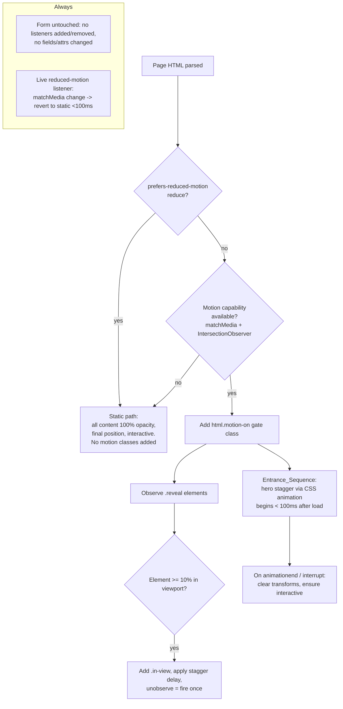

# Design Document

## Overview

This feature adds a **consistent, reusable motion-and-polish system** to all thirteen Target_Pages in the `demowebsite` repository (twelve business-template `index.html` files plus the root landing `index.html`) without introducing a build step, a framework, or any external runtime dependency, and without altering existing content, branding, structure, or the contact/booking ("email") form behavior.

The core design principle, drawn directly from the two design skills, is **restraint with intent**: `frontend-design` frames motion as something that should "serve the subject" where "an orchestrated moment usually beats scattered effects," and `ui-ux-pro-max` supplies the hard numbers — micro-interactions in the 150–300ms band, nothing over 500ms for interactive feedback, `transform`/`opacity` only, a mandatory `prefers-reduced-motion` path, visible focus rings, and color-plus-non-color state cues (see [ui-ux-pro-max motion + UX guidance](../../../../Skills/skills/ui-ux-pro-max/SKILL.md) and its `data/motion.csv` / `data/ux-guidelines.csv`). *Content was rephrased for compliance with licensing restrictions.*

### Existing-state findings (from inspecting the pages)

The pages are **already heavily layered**. Inspecting `beauty-nail-salon/index.html` and the root `index.html` revealed an established, repeatable enhancement convention that this design formalizes and standardizes rather than reinvents:

- **Fenced additive layers.** Enhancements live in HTML-comment-fenced blocks such as `<!-- ANIM2:START --> … <!-- ANIM2:END -->`, `<!-- POLISH-PASS:START/END -->`, `<!-- ENH:START/END -->`, injected near the end of `<body>` (or extra `<style id="…">` blocks in `<head>`). Each block is self-contained inline CSS/JS.
- **Feature-class gating.** JS adds a class to `<html>` (e.g. `anim2-on`, `enh-anim`) **only after** confirming motion is allowed, so every animated rule is opt-in and defaults to "off / fully visible."
- **IntersectionObserver reveals** already exist (`.reveal` → `.in-view` / `.in`), with `io.unobserve()` for fire-once behavior and a graceful fallback when the observer is unavailable.
- **Reduced-motion is already respected** via `@media (prefers-reduced-motion: reduce)` overrides and an early `matchMedia(...).matches` return that skips animation setup entirely.
- **Forms are isolated.** Each page has a single form (`#bookingForm`, `#enquiryForm`, etc.) with a `submit` handler, `data-service` prefill buttons, and a `role="status"` confirmation element. No enhancement layer touches the field set or submit logic.
- **Transform/opacity discipline** and brand-token reuse (`--primary`, `--accent`, `color-mix(...)`) are already the norm.

Because the convention exists but is applied unevenly across the thirteen pages, the design's job is to define **one canonical Motion_System pattern** — a CSS token/utility layer plus a small vanilla-JS orchestrator — and a **per-page application playbook** that raises every page to the same quality bar while honoring each business type's character.

### Goals

- One reusable, copy-adaptable Motion_System (CSS layer + JS layer) applied additively per page.
- Full coverage: all 13 pages get entrance, scroll-reveal, micro-interaction, and (where flagged) ambient motion, plus reduced-motion compliance.
- Zero regressions to content, branding, structure, accessibility, and the contact form.
- Every effect traceable to a Design_Skill_Guidance entry, capped at ≤5 effect types per page.

### Non-Goals

- No redesign, re-copy, re-color, or re-layout of any page (that is explicitly out of scope per Requirements 9).
- No build tooling, bundler, package manager, or external JS/CSS runtime shipped to the pages.
- No changes to form fields, validation, submit destinations, or success/error behavior.

## Architecture

### High-level approach

The Motion_System is delivered as **two fenced inline layers appended to each page**, plus **small per-page annotations** (adding utility classes / `data-*` flags to existing elements). It never replaces existing markup — it decorates it.

```
Target_Page index.html
├── <head>
│   └── (existing inline <style> blocks — untouched)
│   └── <style id="motion-system">        ← NEW: tokens, keyframes, utilities, reduced-motion
├── <body>
│   ├── existing markup (hero, sections, form, footer — semantics untouched)
│   │     · a few elements gain additive class hooks: .reveal, data-atmosphere, data-stagger-group
│   └── <!-- MOTION-SYSTEM:START -->
│       └── <script id="motion-system-js"> ← NEW: capability + reduced-motion gate,
│           entrance orchestration, IntersectionObserver reveal, form-fence guard
│       <!-- MOTION-SYSTEM:END -->
```

### Motion pipeline (runtime)



### Layering & precedence strategy

- The **CSS layer** is added as `<style id="motion-system">` in `<head>`, *after* existing page styles, so its additive rules win where intended but never delete existing declarations. It only introduces **new selectors** (`.reveal`, `.mo-stagger`, `:focus-visible` reinforcement, `[data-atmosphere]`) and **new keyframes**; it does not rewrite existing component rules.
- The **JS layer** is a single IIFE fenced in `<!-- MOTION-SYSTEM:START/END -->`, appended before `</body>`, wrapped in `try/catch` so any failure fails silent and leaves the page fully functional (Requirement 3.6, 6.2).
- **Coexistence with existing layers.** Because some pages already ship `ANIM2`, `ENH`, `POLISH-PASS`, etc., the new layer is **idempotent and defensive**: it checks `documentElement.__motionSystemDone` before running, detects whether a prior reveal/entrance layer exists, and only adds effects that are absent — satisfying Requirement 1.3 (preserve existing animation) and 1.4 (retain existing behavior + surface a skipped-enhancement indication via a console note and a `data-motion-skip` attribute).

### Per-page delivery model

- Changes are made **directly in each `index.html`**.
- Work is committed to a branch and opened as a PR for the user to review on GitHub (the user has no local filesystem access). Each page is a self-contained file so diffs are per-page and reviewable in isolation.

## Components and Interfaces

The Motion_System is composed of three cooperating parts: the **CSS layer**, the **JS layer**, and the **per-page integration playbook**.

### Component 1 — CSS layer (`<style id="motion-system">`)

Responsibilities:

1. **Motion tokens** — CSS custom properties for the shared timing/easing vocabulary (see *Standard Motion Tokens* below).
2. **Keyframes** — `moRise` (entrance fade+translateY), `moFade` (entrance fade+scale), and per-tuning ambient keyframes (`moDrift`, `moFloat`) using only `transform`/`opacity`.
3. **Reveal utilities** — `.reveal` (initial hidden state: `opacity:0; transform:translateY(var(--mo-reveal-shift))`) and `.reveal.in-view` (final: `opacity:1; transform:none`), plus `.mo-stagger > *` delay steps.
4. **Micro-interaction polish** — hover/press transitions on `.btn`, cards, links, restricted to `transform`/`opacity`/`box-shadow`/`color`; `:active` press feedback; reinforced `:focus-visible` outline (≥2px, ≥3:1).
5. **Ambient hooks** — `[data-atmosphere]` decorative motion, capped ≤5% displacement and 4–30s cycles.
6. **Reduced-motion override** — a single `@media (prefers-reduced-motion: reduce)` block that neutralizes every effect (`animation:none; transition:none; opacity:1; transform:none`).

Interface (contract) the CSS layer exposes to markup:

| Hook | Applied to | Effect |
|------|-----------|--------|
| `.reveal` | any content block to reveal on scroll | starts hidden, revealed by JS adding `.in-view` |
| `.mo-stagger` | a parent grid/list | staggers direct children's reveal |
| `data-atmosphere` | a hero/background section | enables ambient loop (only where flagged) |
| `.mo-entrance` | hero container | opts hero children into the entrance sequence |

### Component 2 — JS layer (`<script id="motion-system-js">`, fenced)

A single guarded IIFE. Responsibilities and interface:

- **`init()`** — entry point; runs on DOM ready (or immediately if already parsed).
- **Capability + preference gate** — returns early (static path) if `matchMedia('(prefers-reduced-motion: reduce)').matches` OR `IntersectionObserver` is unavailable. Only on success does it add `html.motion-on`.
- **`clampDuration(ms)`** — pure helper clamping a configured duration into the permitted `[150, 500]` ms band (Requirement 7.5). Exposed for unit/property testing.
- **`revealController`** — creates one `IntersectionObserver` (threshold ~0.1), adds `.in-view` on first intersection, computes and applies a stagger `transition-delay` for siblings entering together, then `unobserve()`s the element (fire-once, Requirement 3.2).
- **`entranceController`** — orchestrates hero entrance ordering (primary element first, then staggered secondaries); on `animationend`/interruption, strips residual transforms and guarantees interactivity (Requirements 2.3, 2.5).
- **`reducedMotionWatcher`** — subscribes to `matchMedia('(prefers-reduced-motion: reduce)')` `change`; on switch to reduce, removes `motion-on`, cancels loops, and snaps content to final static state within 100ms (Requirement 6.4).
- **`formFence`** — an **assertion-only** guard: the JS layer must never call `addEventListener`/`removeEventListener` on any form or its controls, never mutate their attributes, and never reassign `onsubmit`. Represented as a code-review rule and an automated invariant (see Testing Strategy), not runtime behavior.
- **Error isolation** — the whole IIFE is wrapped in `try/catch`; on throw, it does nothing further, leaving the static (fully visible) page intact.

### Component 3 — Per-page integration playbook

A repeatable procedure applied to each of the 13 pages, keeping a shared quality bar while tuning to business type (Requirement 12.4):

1. **Audit** the page for existing motion/reveal/entrance layers and the form element(s).
2. **Add the CSS layer** (`<style id="motion-system">`) in `<head>` after existing styles; adapt only the token *values* to the page's existing brand vars.
3. **Annotate markup additively** — add `.reveal`/`.mo-stagger` to section wrappers and grids that lack a reveal; add `.mo-entrance` to the hero; add `data-atmosphere` only to a hero/background already suited to ambience.
4. **Add the JS layer** fenced before `</body>` (skip if an equivalent, non-regressing layer already covers the behavior — Requirement 1.3/1.4).
5. **Fence the form** — verify the form's markup, fields, and handler are unchanged; any visual polish on inputs is presentation-only (Requirement 8.4).
6. **Per-business tuning** — select the motion character from Design_Skill_Guidance for that business type (see mapping in Data Models), staying within ≤5 effect types and the shared timing/easing/accessibility standard.

### Per-business-type motion tuning

Tuning changes **token values and which optional effects are enabled**, never the underlying system or the quality bar. Each choice traces to a `ui-ux-pro-max` motion tier / UX entry (Requirement 12.1–12.4):

| Target_Page(s) | Character | Motion tuning (within the shared system) |
|---|---|---|
| `beauty-nail-salon`, `mens-salon`, `health-physio-wellness` | Calm / premium | Subtle tier: slower reveals (~500–600ms), gentle ambient drift, minimal hover lift |
| `auto`, `auto-detailing`, `home-hvac` | Confident / mechanical | Standard tier: crisper reveals (~350–450ms), firmer press feedback, no ambient |
| `food-cafe-bakery`, `food-drink` | Warm / appetizing | Standard tier: staggered card reveals, soft hover scale on imagery |
| `pet-services`, `pet-training` | Friendly / lively | Standard tier with slightly springier easing, still ≤300ms micro |
| `health`, `services` | Trustworthy / clean | Subtle–Standard: restrained reveal + focus polish, no ambient |
| Root `Landing_Page` | Showcase / vibrant (dark theme) | Standard: hero entrance, count-up already present preserved, staggered demo-card reveals |

## Standard Motion Tokens and Timings

Defined once in the CSS layer as custom properties; values may be tuned per business type within the permitted bands. All timings are grounded in `ui-ux-pro-max` `motion.csv` and `ux-guidelines.csv`.

| Token | Value (default) | Permitted band | Source / rationale |
|---|---|---|---|
| `--mo-micro` | 200ms | 150–300ms | Micro-interaction timing standard (Req 4.1, 7.1) |
| `--mo-micro-max` | 300ms | ≤300ms | Upper bound for micro feedback |
| `--mo-feedback-max` | 500ms | ≤500ms | Hard cap for interactive feedback (Req 7.3) |
| `--mo-reveal` | 450ms | 200–600ms | Scroll-reveal duration (Req 3.1) |
| `--mo-entrance` | 700ms | 200–1000ms | Hero entrance duration (Req 2.1) |
| `--mo-entrance-delay` | 90ms | 50–300ms | Entrance stagger interval (Req 2.2) |
| `--mo-reveal-stagger` | 90ms | 50–150ms | Scroll-reveal sibling stagger (Req 3.3) |
| `--mo-reveal-shift` | 24px | — | Initial translateY offset for reveals (transform only) |
| `--mo-ease-out` | `cubic-bezier(.2,.7,.2,1)` | non-linear | Entering easing (Req 7.2; ux-guidelines "ease-out for entering") |
| `--mo-ease-standard` | `cubic-bezier(.4,0,.2,1)` | non-linear | Standard micro-interaction easing |
| `--mo-ambient-cycle` | 12s | 4–30s | Ambient loop duration (Req 5.2) |
| `--mo-ambient-shift` | ≤5% | ≤5% | Max ambient displacement/opacity delta (Req 5.1) |

Easing must never be `linear` for interactive feedback (Requirement 7.2). Only `transform` and `opacity` (plus `box-shadow`/`color` for non-layout hover polish) are animated (Requirement 11.1).

## Data Models

This feature has no persistent data store; its "data models" are the **in-memory configuration structures** the JS layer uses and the **structural invariants** it must preserve. Modeling them explicitly makes the correctness properties and tests precise.

### MotionConfig (per page, in JS)

```
MotionConfig {
  reducedMotion: boolean          // from matchMedia('(prefers-reduced-motion: reduce)')
  observerAvailable: boolean      // 'IntersectionObserver' in window
  motionEnabled: boolean          // = !reducedMotion && observerAvailable
  tokens: {
    micro: number(ms)             // clamped to [150,300]
    feedback: number(ms)          // clamped to [150,500]
    reveal: number(ms)            // clamped to [200,600]
    entrance: number(ms)          // clamped to [200,1000]
    entranceStagger: number(ms)   // clamped to [50,300]
    revealStagger: number(ms)     // clamped to [50,150]
    ambientCycle: number(s)       // clamped to [4,30]
  }
  atmosphereSections: Element[]   // only elements flagged [data-atmosphere]
}
```

### RevealState (per observed element)

```
RevealState {
  element: Element
  hasRevealed: boolean            // once true, never re-triggers (fire-once)
  staggerIndex: number            // position within its stagger group
  inAccessibilityTree: true       // content is never removed/hidden from AT before reveal
}
```

### EntranceStep (per hero element)

```
EntranceStep {
  element: Element
  order: number                   // 0 = primary hero element, then ascending
  startOffset: number(ms)         // order * entranceStagger, begins <100ms after load
  finalState: { opacity: 1, transform: 'none', interactive: true }
}
```

### PagePreservationSnapshot (structural invariant model — used by tests)

Captured before and after enhancement to verify no regressions (Requirements 8, 9):

```
PagePreservationSnapshot {
  visibleText: MultiSet<string>       // every visible text token
  colorValues: Set<string>            // all color declarations
  imageRefs: Set<string>              // all image URLs / background-image refs
  fontFamilies: Set<string>           // all font-family declarations
  sectionOrder: List<sectionId>       // top-to-bottom section sequence
  navLinks: List<href>                // ordered nav link set
  forms: List<FormShape>              // see below
}

FormShape {
  formId: string
  fields: List<{ name, type, required }>   // count + names + types + required flags
  submitHandlerBound: boolean
  action/destination: string
}
```

The enhancement is correct with respect to preservation iff, for each page, the `visibleText`, `colorValues`, `imageRefs`, `fontFamilies`, `sectionOrder`, `navLinks`, and every `FormShape` are **equal** in the before and after snapshots (additive-only changes elsewhere are permitted).

### AnimatedProperty (invariant model)

```
AnimatedProperty = the CSS property named in any @keyframes step,
                   transition-property, or animated declaration introduced by the Motion_System
Constraint: AnimatedProperty ∈ { transform, opacity }   // for movement/fade (Req 11.1)
            (box-shadow, color, border-color, outline permitted for non-layout hover/focus polish,
             which do not move already-rendered content)
```


## Correctness Properties

*A property is a characteristic or behavior that should hold true across all valid executions of a system — essentially, a formal statement about what the system should do. Properties serve as the bridge between human-readable specifications and machine-verifiable correctness guarantees.*

**Applicability of property-based testing to this feature.** Much of this work is visual/aesthetic (which hero looks crafted, which easing "feels" native) and is verified by review, snapshot, or headless-browser measurement rather than PBT — see the Testing Strategy. However, a well-defined subset carries genuine universal properties that are ideal for property-based testing: the pure duration-clamp function, the fire-once reveal logic, the stagger-spacing computation, and — most importantly — the **structural invariants** verifiable over parsed HTML/CSS for all thirteen pages (transform/opacity-only, content/branding/structure preservation, and contact-form preservation). Those are captured below.

**Property reflection (consolidation applied).** The 60+ acceptance criteria collapse into the following non-redundant properties. Duration-band checks across 2.1/3.1/4.1/7.1/7.3 were merged into one categorized-bounds property (with the clamp function as its enforcement mechanism). The reduced-motion criteria (2.4, 3.4, 4.6, 5.4, 6.1–6.3, 10.6) were merged into a single static-visible invariant plus a separate live-toggle property. Focus-indicator criteria 4.2 and 10.2 were merged. The preservation criteria (8.1/8.4/8.5 for forms; 9.1–9.5 for content) were consolidated into one content-preservation property and one form-preservation property, since the superset/equality checks subsume the conditional "do-not-apply" guards.

### Property 1: Duration clamp is total, bounded, and idempotent

*For all* real-valued duration inputs `d`, `clampDuration(d)` returns a value within the permitted `[150, 500]` ms band; returns `d` unchanged when `d` is already in range; maps any `d < 150` to `150` and any `d > 500` to `500`; and satisfies `clampDuration(clampDuration(d)) == clampDuration(d)`.

**Validates: Requirements 7.5**

### Property 2: All configured motion timings fall within their category bands

*For all* motion timing tokens emitted by the Motion_System, the resolved value lies within the band mandated for its category: entrance ∈ [200, 1000] ms, scroll-reveal ∈ [200, 600] ms, hover/micro-interaction ∈ [150, 300] ms, and every interactive-feedback animation ≤ 500 ms.

**Validates: Requirements 2.1, 3.1, 4.1, 7.1, 7.3**

### Property 3: Interactive-feedback easing is always non-linear

*For all* micro-interaction and interactive-feedback transitions/animations introduced by the Motion_System, the timing function is a non-linear curve (a `cubic-bezier`/`ease*` family value) and is never `linear` (nor a constant-rate `steps` equivalent).

**Validates: Requirements 7.2**

### Property 4: Movement and fade animate only compositor-friendly, non-reflow properties

*For all* keyframes, transitions, and animated declarations introduced by the Motion_System, every property used for movement or fade is drawn exclusively from `{ transform, opacity }`, and no micro-interaction transitions a layout-affecting property (`width`, `height`, `top`, `left`, `right`, `bottom`, `margin`, `padding`); non-layout polish is limited to `{ box-shadow, color, border-color, outline }`.

**Validates: Requirements 4.4, 11.1**

### Property 5: Scroll-reveal fires exactly once per element

*For all* elements observed for scroll-reveal and *for all* sequences of intersection events (enter, exit, re-enter, direction reversals), the element transitions to its revealed state at most once and the observer stops observing it after the first reveal, so no re-trigger occurs.

**Validates: Requirements 3.2**

### Property 6: Stagger ordering and spacing

*For all* groups of elements that begin animating together (entrance hero elements or sibling scroll-reveals entering within the same 100 ms window), the assigned start offsets are strictly increasing with the primary/first element starting first, and every consecutive pair is separated by an interval that keeps entrance staggers within [50, 300] ms and reveal staggers within [50, 150] ms, such that no two starts fall within the same 50 ms window.

**Validates: Requirements 2.2, 3.3**

### Property 7: Entrance always resolves to a fully visible, interactive, untransformed state

*For all* elements participating in the Entrance_Sequence, whether the sequence completes normally or is interrupted, the element's terminal state is `opacity: 1`, no residual `transform`/offset, and fully interactive (focusable and clickable — not `pointer-events: none`, not removed from tab order by the motion layer).

**Validates: Requirements 2.3, 2.5**

### Property 8: Reduced-motion yields immediate, static, fully accessible content on every page

*For all* thirteen Target_Pages, when `prefers-reduced-motion: reduce` is active, every element that otherwise carries a motion initial-state is presented at `opacity: 1` in its final layout position with no transform, no looping animation, and any residual essential animation capped at ≤ 100 ms; and 100% of content and interactive controls remain visible in the viewport flow and operable (nothing hidden, off-screen, or non-interactive as a result of suppressed motion).

**Validates: Requirements 2.4, 3.4, 4.6, 5.4, 6.1, 6.2, 6.3, 10.6**

### Property 9: Live reduced-motion change reverts to static without reload

*For all* Target_Pages currently displaying motion, when the reduced-motion preference changes to `reduce`, the Motion_System removes its motion gating and places all content in the static, fully visible, interactive state within 100 ms and without a page reload.

**Validates: Requirements 6.4**

### Property 10: Content is in the accessibility tree before it is revealed

*For all* elements awaiting scroll-reveal, the element's content remains present and readable to assistive technology while hidden for motion — hidden state uses only `opacity`/`transform` (never `display: none`, `visibility: hidden`, or `aria-hidden="true"`).

**Validates: Requirements 3.5**

### Property 11: Graceful fallback when visibility detection is unavailable

*For all* reveal-targeted elements, when `IntersectionObserver` is unavailable, the Motion_System presents the element in its final, fully visible state (no lingering hidden reveal state).

**Validates: Requirements 3.6**

### Property 12: Focus indicator is persistent, thick enough, and sufficiently contrasting

*For all* interactive elements, keyboard focus produces a persistent focus indicator at least 2 CSS pixels thick with a contrast ratio of at least 3:1 against both the element's unfocused appearance and the adjacent background.

**Validates: Requirements 4.2, 10.2**

### Property 13: Text contrast meets WCAG minimums

*For all* text nodes on every Target_Page, the computed contrast ratio against its background is at least 4.5:1 for body text and at least 3:1 for large-scale text (≥18pt, or ≥14pt bold).

**Validates: Requirements 10.3**

### Property 14: Pressed state exists and hover is reversible

*For all* interactive elements, a pressed/active state is expressed through at least one of `{ color, opacity, box-shadow (elevation), transform }`; and applying then removing a hover or press returns the element's computed presentation to its base state (round-trip identity).

**Validates: Requirements 4.3, 4.5**

### Property 15: Ambient motion is bounded and seamless

*For all* atmosphere-enabled sections, each ambient animation cycle has a duration within [4, 30] seconds, loops seamlessly (its first and last keyframes coincide), and changes any element's position or opacity by no more than 5% of that element's rendered dimension or opacity value per cycle.

**Validates: Requirements 5.1, 5.2**

### Property 16: Ambient motion is decorative and confined to flagged sections

*For all* sections, ambient motion is applied only where the section is flagged atmosphere-enabled; sections not so flagged receive no ambient motion; and with ambient motion disabled, all information on the page remains fully perceivable and comprehensible.

**Validates: Requirements 5.3, 5.5**

### Property 17: Decorative added elements are hidden from assistive technology

*For all* purely decorative elements the Motion_System adds (ambient layers, sheens, overlays), the element is marked `aria-hidden="true"` (or given a presentation role) and carries no readable content, so assistive technology does not announce it.

**Validates: Requirements 10.5**

### Property 18: Interactive and status states carry a non-color cue

*For all* interactive or status states affected by the Motion_System (including any polished form confirmation/error indicators), the state is conveyed by at least one non-color cue (visible text, icon, shape, or pattern) in addition to color.

**Validates: Requirements 10.4**

### Property 19: No focus trap is introduced and all interactive elements stay operable

*For all* interactive elements on every Target_Page, the element remains reachable and operable by keyboard after enhancement, and the Motion_System introduces no focus trap (no rogue focus handlers or `tabindex` manipulation that prevents moving focus away).

**Validates: Requirements 10.1**

### Property 20: Content, branding, and structure are preserved (additive-only superset)

*For all* thirteen Target_Pages, the enhanced document is a superset of the baseline with respect to pre-existing nodes, attributes, and style declarations: the multiset of visible text tokens is identical; every baseline color value, image reference, and `font-family` declaration is still present and unmodified; the top-to-bottom section order and the ordered set of navigation links are identical; and no existing element, attribute, or style declaration is removed or altered.

**Validates: Requirements 8.4, 9.1, 9.2, 9.3, 9.4, 9.5**

### Property 21: Contact form shape and handler binding are preserved and untouched by motion

*For all* contact/booking forms on every Target_Page, the form's markup structure, complete field set (identical field count, field names, input types, and required/optional status), submit-handler binding, and submission destination are identical before and after enhancement; and the Motion_System binds no event listeners to any form or its controls and mutates none of their functional attributes (only presentation attributes may differ).

**Validates: Requirements 8.1, 8.4, 8.5**

### Property 22: Each page remains a self-contained static file

*For all* thirteen Target_Pages, the Motion_System introduces no new external runtime dependency and no build step — the enhanced `index.html` still runs standalone by opening the file (pre-existing external references such as web fonts are unchanged, and no bundler or added `<script src>` runtime is required).

**Validates: Requirements 11.5**

## Error Handling

Because the pages are static and must never regress, error handling is dominated by **graceful degradation and fail-silent** behavior:

| Condition | Handling | Requirement |
|---|---|---|
| `prefers-reduced-motion: reduce` | Skip all motion setup; static path renders everything visible/interactive; add no motion classes | 2.4, 6.x |
| `IntersectionObserver` unavailable | Skip reveal wiring; ensure all `.reveal` elements are fully visible (remove hidden state) | 3.6 |
| `matchMedia` unavailable | Treat as motion-allowed but degrade to CSS-only reveals visible by default; never leave content hidden | 6.x |
| JS layer throws at any point | Entire IIFE wrapped in `try/catch`; on throw, do nothing further — CSS defaults leave content visible and the form fully functional | 3.6, 8.x, 9.x |
| A prior/equivalent motion layer already present | Detect and skip conflicting wiring; retain existing animation; set `data-motion-skip` + emit a console note (the "surfaced indication") | 1.3, 1.4 |
| Duration configured out of range | `clampDuration` clamps to nearest permitted bound before use | 7.5 |
| Live change to reduced-motion mid-session | `matchMedia` `change` listener snaps to static state within 100ms, cancels loops, no reload | 6.4 |
| Ambient on a non-suitable/unflagged section | Ambient never applied (opt-in via `[data-atmosphere]` only) | 5.5 |
| Form interaction | Motion_System never binds to forms; if any polish selector could match a form control functionally, it is presentation-only | 8.x |

**Fail-safe default:** every element's *resting* (non-JS, non-animated) state is its final, fully visible, interactive state. Motion is strictly additive and opt-in; the absence or failure of the Motion_System can never hide content or break the form.

## Testing Strategy

A **dual approach** is used: property-based tests for the universal invariants and pure logic identified above, plus example/integration tests for behavior that does not vary with generated input (visual polish, exact form behavior, and runtime performance). Because the shipped pages must remain dependency-free (Requirement 11.5), **all tests live in a separate, dev-only harness** (not shipped to the sites) and never modify the `index.html` runtime footprint.

### Tooling

- **Test runner + PBT library:** Node.js with **[fast-check](https://github.com/dubzzz/fast-check)** for property-based tests (do not implement PBT from scratch).
- **DOM/CSS parsing:** `jsdom` for structural and behavioral assertions; a CSS parser (e.g. `postcss`) for keyframe/transition/property analysis.
- **Headless browser** (e.g. Playwright) for runtime performance and CLS/FPS measurements and for reduced-motion emulation end-to-end.
- **Baseline snapshots:** the pre-enhancement version of each page (from git history) provides the `PagePreservationSnapshot` baseline for the preservation properties.

### Property-based tests

- One property-based test **per correctness property (Properties 1–22)**, each configured to run **a minimum of 100 iterations**.
- Each test is tagged with a comment referencing its design property, using the format:
  `// Feature: website-animation-ux-polish, Property {number}: {property_text}`
- Generators:
  - Property 1 (clamp): generate arbitrary reals/ints including out-of-range and boundary values (150, 500).
  - Property 5 (fire-once): generate arbitrary sequences of intersection enter/exit events.
  - Property 6 (stagger): generate arbitrary group sizes.
  - Properties 4, 8, 10, 11, 20, 21, 22: quantify over the set of thirteen pages (and, where applicable, over all parsed animated declarations / form shapes within them) — the "for all pages / for all declarations" universal is realized by iterating parsed structures with fast-check driving element/among selection where randomization adds coverage.
- Structural-invariant properties (4, 20, 21, 22) parse baseline vs. enhanced HTML/CSS and assert the superset/equality relationships.

### Example-based unit tests

Reserved for specific, non-universal behavior and edge cases:
- **Coverage (1.1, 1.2):** assert each of the 13 enhanced pages contains ≥1 new animation construct and ≥1 UX-polish construct vs. baseline.
- **Conflict skip (1.4):** on pages already carrying an equivalent reveal/entrance layer, assert the new layer detects it, skips, and sets `data-motion-skip` / logs the note.
- **Form behavior equivalence (8.2, 8.3):** simulate valid and invalid submissions before and after enhancement; assert identical validation outcomes, identical destination, identical success/error indications, and (for invalid input) no submission — this is the critical "email thing still works" regression guard.
- **Interrupt edge case (2.5):** simulate entrance interruption; assert final static/visible/interactive state.
- **No-observer edge case (3.6):** run with `IntersectionObserver` undefined; assert content fully visible.

### Integration / performance tests (headless browser)

For criteria that measure runtime behavior and do not benefit from 100 generated iterations:
- **CLS (11.2):** load representative pages, script scroll, assert cumulative layout shift attributed to entrance/reveal ≤ 0.1.
- **Main-thread tasks (11.3):** profile long tasks during scripted scroll; assert ≤ 50 ms.
- **Frame rate (11.4):** measure FPS during entrance/reveal; assert ≥ 55 fps (per-frame ≤ 16.7 ms).
- **Concurrent micro-interactions (7.4):** verify a single user action does not trigger more than 3 simultaneous micro-interactions.

### Design-skill traceability review (12.1–12.4)

A **trace table** is maintained (and reviewed per page) mapping every applied motion/UX effect to a specific Design_Skill_Guidance entry (a `ui-ux-pro-max` `motion.csv`/`ux-guidelines.csv` row, or a `frontend-design` principle). The review also confirms each page uses ≤5 distinct motion effect types supporting one coherent theme (12.3) and matches its business-type tuning row (12.4). Effects without a guidance source are excluded (12.2).

### Accessibility checks

- Automated: focus-indicator thickness/contrast (Property 12), text contrast (Property 13), `aria-hidden` on decorative nodes (Property 17), keyboard reachability / no-trap (Property 19), non-color cues (Property 18).
- Manual/assistive pass: keyboard-only walkthrough and a reduced-motion walkthrough on a representative sample, per the `ui-ux-pro-max` pre-delivery checklist (reduced motion enabled, visible focus, contrast verified independently).
