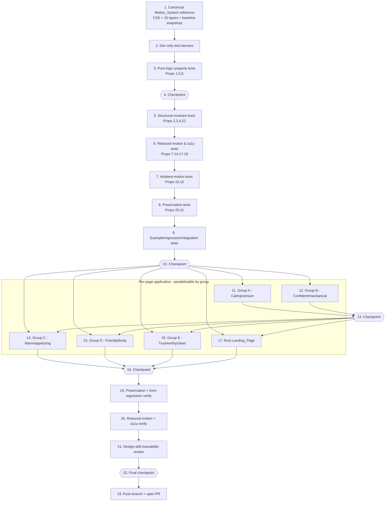

# Implementation Plan: website-animation-ux-polish

## Overview

This plan turns the design's reusable Motion_System into an incremental, additive
implementation across all thirteen Target_Pages (twelve business templates plus the
root landing `index.html`), plus a **dev-only** test harness that never ships to the
pages.

The build order is deliberate:

1. **Establish the canonical Motion_System** (CSS token/utility layer + guarded JS IIFE)
   as a reference template, and capture baseline `PagePreservationSnapshot`s from git
   history so every later change can be regression-checked.
2. **Stand up the dev-only test harness** and grow the property-based tests
   (Properties 1–22) and example/regression tests (especially the contact-form behavior
   equivalence guard) alongside the code.
3. **Apply and business-tune the Motion_System per page** following the integration
   playbook (audit → CSS layer → additive markup annotation → JS layer → form-fence
   verification → business tuning), grouped so independent pages can proceed in parallel.
4. **Verify** preservation/form-regression, reduced-motion, and design-skill traceability.
5. **Open a PR** for review.

All page changes are additive and fenced. The shipped `index.html` files gain no build
step and no external runtime dependency (Requirement 11.5). The test harness lives in a
separate `tools/motion-tests/` workspace and is never referenced by the pages.

**Implementation stack:** vanilla HTML/CSS/JS for the pages (as in the existing files);
Node.js + [fast-check](https://github.com/dubzzz/fast-check) for PBT, `jsdom` + `postcss`
for structural/CSS parsing, and Playwright for headless perf/a11y checks in the harness.

---

## Tasks

- [x] 1. Establish the canonical Motion_System reference template
  - [x] 1.1 Author the canonical CSS layer (`<style id="motion-system">`)
    - Create the reference CSS layer as a standalone reviewable file at `tools/motion-tests/reference/motion-system.css` (source of truth to be copied inline into pages later).
    - Define motion tokens as custom properties per the Standard Motion Tokens table (`--mo-micro`, `--mo-micro-max`, `--mo-feedback-max`, `--mo-reveal`, `--mo-entrance`, `--mo-entrance-delay`, `--mo-reveal-stagger`, `--mo-reveal-shift`, `--mo-ease-out`, `--mo-ease-standard`, `--mo-ambient-cycle`, `--mo-ambient-shift`).
    - Define keyframes `moRise`, `moFade`, `moDrift`, `moFloat` using only `transform`/`opacity`.
    - Define reveal utilities (`.reveal`, `.reveal.in-view`, `.mo-stagger > *`), micro-interaction polish (hover/`:active`/`:focus-visible` on `.btn`/cards/links restricted to `transform`/`opacity`/`box-shadow`/`color`), and `[data-atmosphere]` ambient hooks (≤5% displacement, 4–30s cycle).
    - Add the single `@media (prefers-reduced-motion: reduce)` override neutralizing all effects (`animation:none; transition:none; opacity:1; transform:none`).
    - _Requirements: 2.1, 2.2, 3.1, 3.3, 4.1, 4.2, 4.3, 4.4, 5.1, 5.2, 6.1, 7.1, 7.2, 7.3, 11.1_

  - [x] 1.2 Author the canonical JS layer (`<script id="motion-system-js">` IIFE)
    - Create the reference JS layer at `tools/motion-tests/reference/motion-system.js` as an ES-module-exportable source that also serializes to the fenced inline IIFE.
    - Implement the capability + preference gate (early static return when `prefers-reduced-motion: reduce` or `IntersectionObserver` unavailable; only then add `html.motion-on`), `documentElement.__motionSystemDone` idempotency guard, and top-level `try/catch` fail-silent wrapper.
    - Implement `clampDuration(ms)` as a pure exported helper clamping into `[150, 500]`.
    - Implement `revealController` (single IntersectionObserver ~0.1 threshold, add `.in-view`, apply sibling stagger delay, `unobserve()` for fire-once), `entranceController` (primary-first staggered hero ordering; on `animationend`/interrupt strip transforms + guarantee interactivity), and `reducedMotionWatcher` (matchMedia `change` → snap to static within 100ms, no reload).
    - Implement the `formFence` discipline as an explicit code rule: the IIFE binds no listeners to forms/controls, mutates no form attributes, never reassigns `onsubmit`; add the prior-layer detection that sets `data-motion-skip` + console note when an equivalent layer already exists.
    - _Requirements: 1.3, 1.4, 2.2, 2.3, 2.5, 3.2, 3.6, 6.2, 6.4, 7.5, 8.1, 8.4, 8.5_

  - [x] 1.3 Capture baseline PagePreservationSnapshots from git history
    - Add `tools/motion-tests/baseline/capture-baseline.js` that reads each of the 13 pages at the pre-enhancement git ref and writes a `PagePreservationSnapshot` JSON (visibleText multiset, colorValues, imageRefs, fontFamilies, sectionOrder, navLinks, and per-form FormShape).
    - Store the captured baselines under `tools/motion-tests/baseline/snapshots/` keyed by page id for later before/after comparison.
    - _Requirements: 8.1, 9.1, 9.2, 9.3, 9.4_

- [x] 2. Stand up the dev-only test harness
  - Initialize `tools/motion-tests/` as an isolated Node package (its own `package.json`) with `fast-check`, `jsdom`, `postcss`, and Playwright as devDependencies; confirm nothing under it is referenced by any `index.html`.
  - Add shared test utilities: HTML/CSS parsers (jsdom + postcss), a snapshot-diff helper, an animated-declaration extractor, and a page-list module enumerating all 13 Target_Pages.
  - _Requirements: 11.5_

- [x] 3. Implement pure-logic property tests (against the reference JS layer)
  - [x]* 3.1 Write property test for the duration clamp
    - **Property 1: Duration clamp is total, bounded, and idempotent**
    - Generate arbitrary reals/ints including out-of-range and the boundaries 150/500.
    - **Validates: Requirements 7.5**
  - [x]* 3.2 Write property test for fire-once scroll-reveal
    - **Property 5: Scroll-reveal fires exactly once per element**
    - Generate arbitrary sequences of intersection enter/exit/re-enter events.
    - **Validates: Requirements 3.2**
  - [x]* 3.3 Write property test for stagger ordering and spacing
    - **Property 6: Stagger ordering and spacing**
    - Generate arbitrary group sizes; assert strictly increasing offsets, primary-first, entrance stagger ∈ [50,300]ms, reveal stagger ∈ [50,150]ms, no two starts within 50ms.
    - **Validates: Requirements 2.2, 3.3**

- [x] 4. Checkpoint - reference layers and pure-logic tests
  - Ensure all tests pass, ask the user if questions arise.

- [x] 5. Implement structural-invariant property tests (parse reference-annotated fixture + all pages)
  - [x]* 5.1 Write property test for motion timing bands
    - **Property 2: All configured motion timings fall within their category bands**
    - **Validates: Requirements 2.1, 3.1, 4.1, 7.1, 7.3**
  - [x]* 5.2 Write property test for non-linear easing
    - **Property 3: Interactive-feedback easing is always non-linear**
    - **Validates: Requirements 7.2**
  - [x]* 5.3 Write property test for compositor-only animated properties
    - **Property 4: Movement and fade animate only compositor-friendly, non-reflow properties**
    - Parse keyframes/transitions; assert movement/fade ∈ {transform, opacity}, polish ∈ {box-shadow, color, border-color, outline}, no layout props.
    - **Validates: Requirements 4.4, 11.1**
  - [x]* 5.4 Write property test for self-contained static output
    - **Property 22: Each page remains a self-contained static file**
    - Assert no added `<script src>` runtime / no build step introduced across all 13 pages.
    - **Validates: Requirements 11.5**

- [x] 6. Implement reduced-motion and accessibility property tests
  - [x]* 6.1 Write property test for reduced-motion static/accessible state
    - **Property 8: Reduced-motion yields immediate, static, fully accessible content on every page**
    - Quantify over all 13 pages under emulated `prefers-reduced-motion: reduce`.
    - **Validates: Requirements 2.4, 3.4, 4.6, 5.4, 6.1, 6.2, 6.3, 10.6**
  - [x]* 6.2 Write property test for live reduced-motion toggle
    - **Property 9: Live reduced-motion change reverts to static without reload**
    - **Validates: Requirements 6.4**
  - [x]* 6.3 Write property test for entrance terminal state
    - **Property 7: Entrance always resolves to a fully visible, interactive, untransformed state**
    - Cover both normal completion and interruption.
    - **Validates: Requirements 2.3, 2.5**
  - [x]* 6.4 Write property test for pre-reveal accessibility-tree presence
    - **Property 10: Content is in the accessibility tree before it is revealed**
    - Assert hidden state uses only opacity/transform (never display:none/visibility:hidden/aria-hidden).
    - **Validates: Requirements 3.5**
  - [x]* 6.5 Write property test for observer-unavailable fallback
    - **Property 11: Graceful fallback when visibility detection is unavailable**
    - **Validates: Requirements 3.6**
  - [x]* 6.6 Write property test for focus indicator quality
    - **Property 12: Focus indicator is persistent, thick enough, and sufficiently contrasting**
    - **Validates: Requirements 4.2, 10.2**
  - [x]* 6.7 Write property test for text contrast minimums
    - **Property 13: Text contrast meets WCAG minimums**
    - **Validates: Requirements 10.3**
  - [x]* 6.8 Write property test for pressed-state existence and hover reversibility
    - **Property 14: Pressed state exists and hover is reversible**
    - **Validates: Requirements 4.3, 4.5**
  - [x]* 6.9 Write property test for no-focus-trap / keyboard operability
    - **Property 19: No focus trap is introduced and all interactive elements stay operable**
    - **Validates: Requirements 10.1**
  - [x]* 6.10 Write property test for decorative-element aria-hidden
    - **Property 17: Decorative added elements are hidden from assistive technology**
    - **Validates: Requirements 10.5**
  - [x]* 6.11 Write property test for non-color state cues
    - **Property 18: Interactive and status states carry a non-color cue**
    - **Validates: Requirements 10.4**

- [x] 7. Implement ambient-motion property tests
  - [x]* 7.1 Write property test for bounded, seamless ambient motion
    - **Property 15: Ambient motion is bounded and seamless**
    - Assert cycle ∈ [4,30]s, first/last keyframes coincide, ≤5% displacement/opacity delta.
    - **Validates: Requirements 5.1, 5.2**
  - [x]* 7.2 Write property test for decorative, flag-confined ambient motion
    - **Property 16: Ambient motion is decorative and confined to flagged sections**
    - **Validates: Requirements 5.3, 5.5**

- [x] 8. Implement preservation property tests (baseline vs. enhanced)
  - [x]* 8.1 Write property test for content/branding/structure preservation
    - **Property 20: Content, branding, and structure are preserved (additive-only superset)**
    - Compare baseline vs. enhanced snapshot for all 13 pages: identical visibleText multiset, colorValues, imageRefs, fontFamilies, sectionOrder, navLinks; no baseline node/attr/declaration removed.
    - **Validates: Requirements 8.4, 9.1, 9.2, 9.3, 9.4, 9.5**
  - [x]* 8.2 Write property test for contact-form preservation
    - **Property 21: Contact form shape and handler binding are preserved and untouched by motion**
    - Assert identical FormShape (field count/names/types/required, submit-handler binding, destination) and that no listeners/functional attrs are added by the motion layer.
    - **Validates: Requirements 8.1, 8.4, 8.5**

- [x] 9. Implement example, regression, and integration tests
  - [x]* 9.1 Write coverage example tests
    - Assert each of the 13 enhanced pages contains ≥1 new animation construct and ≥1 UX-polish construct vs. baseline.
    - _Requirements: 1.1, 1.2_
  - [x]* 9.2 Write conflict-skip example test
    - On pages already carrying an equivalent reveal/entrance layer, assert the new layer detects it, skips, and sets `data-motion-skip` + logs the note.
    - _Requirements: 1.3, 1.4_
  - [x]* 9.3 Write the contact-form behavior equivalence guard (critical regression test)
    - Simulate valid and invalid submissions before and after enhancement; assert identical validation outcomes, identical destination, identical success/error indications, and no submission on invalid input.
    - _Requirements: 8.2, 8.3_
  - [x]* 9.4 Write entrance-interrupt and no-observer edge-case tests
    - Interrupt entrance → assert final static/visible/interactive state; run with `IntersectionObserver` undefined → assert content fully visible.
    - _Requirements: 2.5, 3.6_
  - [x]* 9.5 Write headless-browser performance/integration tests (Playwright)
    - CLS ≤ 0.1 attributed to entrance/reveal; main-thread animation tasks ≤ 50ms; ≥55fps (≤16.7ms/frame) during entrance/reveal; ≤3 simultaneous micro-interactions per user action.
    - _Requirements: 7.4, 11.2, 11.3, 11.4_

- [x] 10. Checkpoint - full harness green against reference layers
  - Ensure all tests pass, ask the user if questions arise.

- [x] 11. Apply Motion_System to Group A pages — Calm / premium (subtle tier)
  - [x] 11.1 Enhance `beauty-nail-salon/index.html`
    - Audit existing motion/reveal/form layers; inline the CSS layer in `<head>` after existing styles with brand-var-adapted tokens; additively annotate hero (`.mo-entrance`) and section wrappers/grids (`.reveal`/`.mo-stagger`); add `data-atmosphere` only where suited; append the fenced JS layer before `</body>` (skip if equivalent non-regressing layer exists); verify form fence; tune to subtle tier (~500–600ms reveals, gentle drift, minimal hover lift) per Design_Skill_Guidance.
    - _Requirements: 1.1, 1.2, 1.3, 1.4, 2.1, 2.2, 2.3, 3.1, 3.2, 3.3, 3.5, 4.1, 4.2, 4.3, 4.4, 4.5, 5.1, 5.2, 5.3, 6.1, 6.2, 6.3, 6.4, 7.1, 7.2, 7.5, 8.1, 8.4, 8.5, 9.1, 9.2, 9.3, 9.4, 10.1, 10.2, 10.5, 11.1, 11.5, 12.1, 12.3, 12.4_
  - [x] 11.2 Enhance `mens-salon/index.html`
    - Same playbook and subtle-tier tuning as 11.1.
    - _Requirements: 1.1, 1.2, 1.3, 1.4, 2.1, 2.2, 2.3, 3.1, 3.2, 3.3, 3.5, 4.1, 4.2, 4.3, 4.4, 4.5, 5.1, 5.2, 5.3, 6.1, 6.2, 6.3, 6.4, 7.1, 7.2, 7.5, 8.1, 8.4, 8.5, 9.1, 9.2, 9.3, 9.4, 10.1, 10.2, 10.5, 11.1, 11.5, 12.1, 12.3, 12.4_
  - [x] 11.3 Enhance `health-physio-wellness/index.html`
    - Same playbook and subtle-tier tuning as 11.1.
    - _Requirements: 1.1, 1.2, 1.3, 1.4, 2.1, 2.2, 2.3, 3.1, 3.2, 3.3, 3.5, 4.1, 4.2, 4.3, 4.4, 4.5, 5.1, 5.2, 5.3, 6.1, 6.2, 6.3, 6.4, 7.1, 7.2, 7.5, 8.1, 8.4, 8.5, 9.1, 9.2, 9.3, 9.4, 10.1, 10.2, 10.5, 11.1, 11.5, 12.1, 12.3, 12.4_

- [x] 12. Apply Motion_System to Group B pages — Confident / mechanical (standard tier, no ambient)
  - [x] 12.1 Enhance `auto/index.html`
    - Playbook as above; standard-tier tuning (~350–450ms crisper reveals, firmer press feedback, no ambient / no `data-atmosphere`).
    - _Requirements: 1.1, 1.2, 1.3, 1.4, 2.1, 2.2, 2.3, 3.1, 3.2, 3.3, 3.5, 4.1, 4.2, 4.3, 4.4, 4.5, 5.5, 6.1, 6.2, 6.3, 6.4, 7.1, 7.2, 7.5, 8.1, 8.4, 8.5, 9.1, 9.2, 9.3, 9.4, 10.1, 10.2, 10.5, 11.1, 11.5, 12.1, 12.3, 12.4_
  - [x] 12.2 Enhance `auto-detailing/index.html`
    - Same playbook and standard-tier (no ambient) tuning as 12.1.
    - _Requirements: 1.1, 1.2, 1.3, 1.4, 2.1, 2.2, 2.3, 3.1, 3.2, 3.3, 3.5, 4.1, 4.2, 4.3, 4.4, 4.5, 5.5, 6.1, 6.2, 6.3, 6.4, 7.1, 7.2, 7.5, 8.1, 8.4, 8.5, 9.1, 9.2, 9.3, 9.4, 10.1, 10.2, 10.5, 11.1, 11.5, 12.1, 12.3, 12.4_
  - [x] 12.3 Enhance `home-hvac/index.html`
    - Same playbook and standard-tier (no ambient) tuning as 12.1.
    - _Requirements: 1.1, 1.2, 1.3, 1.4, 2.1, 2.2, 2.3, 3.1, 3.2, 3.3, 3.5, 4.1, 4.2, 4.3, 4.4, 4.5, 5.5, 6.1, 6.2, 6.3, 6.4, 7.1, 7.2, 7.5, 8.1, 8.4, 8.5, 9.1, 9.2, 9.3, 9.4, 10.1, 10.2, 10.5, 11.1, 11.5, 12.1, 12.3, 12.4_

- [x] 13. Checkpoint - Groups A & B preserved and green
  - Ensure all tests pass, ask the user if questions arise.

- [x] 14. Apply Motion_System to Group C pages — Warm / appetizing (standard tier)
  - [x] 14.1 Enhance `food-cafe-bakery/index.html`
    - Playbook as above; standard-tier tuning with staggered card reveals and soft hover scale on imagery.
    - _Requirements: 1.1, 1.2, 1.3, 1.4, 2.1, 2.2, 2.3, 3.1, 3.2, 3.3, 3.5, 4.1, 4.2, 4.3, 4.4, 4.5, 5.1, 5.2, 5.3, 6.1, 6.2, 6.3, 6.4, 7.1, 7.2, 7.5, 8.1, 8.4, 8.5, 9.1, 9.2, 9.3, 9.4, 10.1, 10.2, 10.5, 11.1, 11.5, 12.1, 12.3, 12.4_
  - [x] 14.2 Enhance `food-drink/index.html`
    - Same playbook and warm/appetizing tuning as 14.1.
    - _Requirements: 1.1, 1.2, 1.3, 1.4, 2.1, 2.2, 2.3, 3.1, 3.2, 3.3, 3.5, 4.1, 4.2, 4.3, 4.4, 4.5, 5.1, 5.2, 5.3, 6.1, 6.2, 6.3, 6.4, 7.1, 7.2, 7.5, 8.1, 8.4, 8.5, 9.1, 9.2, 9.3, 9.4, 10.1, 10.2, 10.5, 11.1, 11.5, 12.1, 12.3, 12.4_

- [x] 15. Apply Motion_System to Group D pages — Friendly / lively (standard tier, springier easing)
  - [x] 15.1 Enhance `pet-services/index.html`
    - Playbook as above; springier easing while keeping micro ≤300ms.
    - _Requirements: 1.1, 1.2, 1.3, 1.4, 2.1, 2.2, 2.3, 3.1, 3.2, 3.3, 3.5, 4.1, 4.2, 4.3, 4.4, 4.5, 5.1, 5.2, 5.3, 6.1, 6.2, 6.3, 6.4, 7.1, 7.2, 7.5, 8.1, 8.4, 8.5, 9.1, 9.2, 9.3, 9.4, 10.1, 10.2, 10.5, 11.1, 11.5, 12.1, 12.3, 12.4_
  - [x] 15.2 Enhance `pet-training/index.html`
    - Same playbook and friendly/lively tuning as 15.1.
    - _Requirements: 1.1, 1.2, 1.3, 1.4, 2.1, 2.2, 2.3, 3.1, 3.2, 3.3, 3.5, 4.1, 4.2, 4.3, 4.4, 4.5, 5.1, 5.2, 5.3, 6.1, 6.2, 6.3, 6.4, 7.1, 7.2, 7.5, 8.1, 8.4, 8.5, 9.1, 9.2, 9.3, 9.4, 10.1, 10.2, 10.5, 11.1, 11.5, 12.1, 12.3, 12.4_

- [x] 16. Apply Motion_System to Group E pages — Trustworthy / clean (subtle–standard, no ambient)
  - [x] 16.1 Enhance `health/index.html`
    - Playbook as above; restrained reveal + focus polish, no ambient.
    - _Requirements: 1.1, 1.2, 1.3, 1.4, 2.1, 2.2, 2.3, 3.1, 3.2, 3.3, 3.5, 4.1, 4.2, 4.3, 4.4, 4.5, 5.5, 6.1, 6.2, 6.3, 6.4, 7.1, 7.2, 7.5, 8.1, 8.4, 8.5, 9.1, 9.2, 9.3, 9.4, 10.1, 10.2, 10.5, 11.1, 11.5, 12.1, 12.3, 12.4_
  - [x] 16.2 Enhance `services/index.html`
    - Same playbook and trustworthy/clean tuning as 16.1.
    - _Requirements: 1.1, 1.2, 1.3, 1.4, 2.1, 2.2, 2.3, 3.1, 3.2, 3.3, 3.5, 4.1, 4.2, 4.3, 4.4, 4.5, 5.5, 6.1, 6.2, 6.3, 6.4, 7.1, 7.2, 7.5, 8.1, 8.4, 8.5, 9.1, 9.2, 9.3, 9.4, 10.1, 10.2, 10.5, 11.1, 11.5, 12.1, 12.3, 12.4_

- [x] 17. Apply Motion_System to the root Landing_Page — Showcase / vibrant (dark theme)
  - [x] 17.1 Enhance root `index.html`
    - Playbook as above; hero entrance, preserve existing count-up behavior (Req 1.3), staggered demo-card reveals; ensure the new layer is idempotent with any existing layers.
    - _Requirements: 1.2, 1.3, 1.4, 2.1, 2.2, 2.3, 3.1, 3.2, 3.3, 3.5, 4.1, 4.2, 4.3, 4.4, 4.5, 5.1, 5.2, 5.3, 6.1, 6.2, 6.3, 6.4, 7.1, 7.2, 7.5, 8.1, 8.4, 8.5, 9.1, 9.2, 9.3, 9.4, 10.1, 10.2, 10.5, 11.1, 11.5, 12.1, 12.3, 12.4_

- [x] 18. Checkpoint - all 13 pages enhanced and green
  - Ensure all tests pass, ask the user if questions arise.

- [x] 19. Run full preservation and contact-form regression verification across all pages
  - Re-run the preservation property tests (Property 20) and the contact-form preservation + behavior-equivalence tests (Property 21 + example test 9.3) against every enhanced page vs. its baseline snapshot; fix any additive-only violation (revert offending change; re-apply additively).
  - _Requirements: 8.1, 8.2, 8.3, 8.4, 8.5, 9.1, 9.2, 9.3, 9.4, 9.5_

- [x] 20. Run reduced-motion and accessibility verification across all pages
  - Execute the reduced-motion property tests (Properties 8, 9), accessibility property tests (Properties 12, 13, 17, 18, 19), and the headless reduced-motion/perf checks (task 9.5) across all 13 pages; remediate failures.
  - _Requirements: 2.4, 3.4, 4.6, 5.4, 6.1, 6.2, 6.3, 6.4, 7.4, 10.1, 10.2, 10.3, 10.4, 10.5, 10.6, 11.2, 11.3, 11.4_

- [x] 21. Complete the design-skill traceability review
  - Build/verify the per-page trace table mapping every applied motion/UX effect to a specific Design_Skill_Guidance entry (a `ui-ux-pro-max` `motion.csv`/`ux-guidelines.csv` row or a `frontend-design` principle); confirm ≤5 distinct motion effect types per page supporting one coherent theme, correct business-type tuning, and that no ungrounded effect ships.
  - _Requirements: 12.1, 12.2, 12.3, 12.4_

- [x] 22. Final checkpoint - full suite green
  - Ensure all tests pass, ask the user if questions arise.

- [ ] 23. Push branch and open a pull request for review
  - Push the feature branch and open a PR containing all 13 enhanced pages plus the dev-only `tools/motion-tests/` harness; the PR description summarizes per-page tuning and links the trace table so the user can review each self-contained page diff on GitHub.
  - _Requirements: 1.1, 1.2_

---

## Task Dependency Graph

**Parallelization notes:**
- Task 1 (reference layers + baselines) and Task 2 (harness) are the foundation; everything depends on them.
- Property/example tests (Tasks 3, 5–9) target the reference layers and page baselines, so they can be written before or in parallel with per-page work, but should be green (Checkpoint 10) before page application starts so each page is validated as it lands.
- Per-page groups (Tasks 11, 12, 14, 15, 16, 17) touch independent, self-contained `index.html` files and can be executed in parallel. Groups A & B gate Checkpoint 13; Groups C, D, E and the landing page gate Checkpoint 18.
- Verification tasks (19–21) require all pages enhanced; the PR (Task 23) is last.

## Notes

- Tasks marked with `*` are optional test sub-tasks and can be skipped for a faster MVP; core implementation and verification tasks are never optional.
- Every page change is **additive and fenced** (`<style id="motion-system">` + `<!-- MOTION-SYSTEM:START/END -->` JS IIFE) and must leave existing content, branding, structure, and the contact form untouched.
- The `tools/motion-tests/` harness is **dev-only** and must never be referenced by any shipped `index.html` (Requirement 11.5).
- Each property test runs a minimum of 100 iterations and is tagged `// Feature: website-animation-ux-polish, Property {number}: {property_text}`.
- Each task references specific requirements and/or design correctness properties for traceability.
